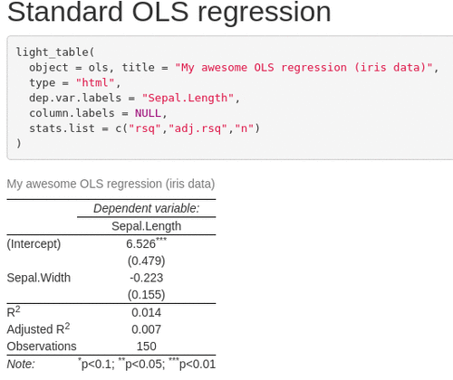
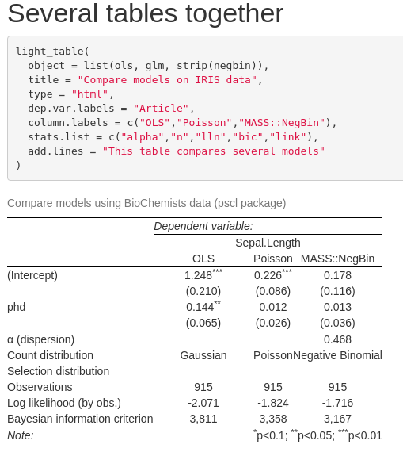
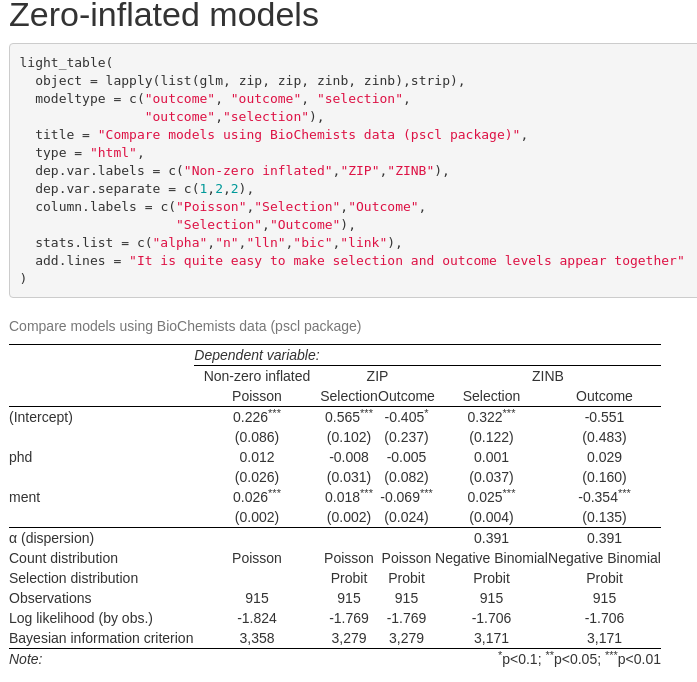
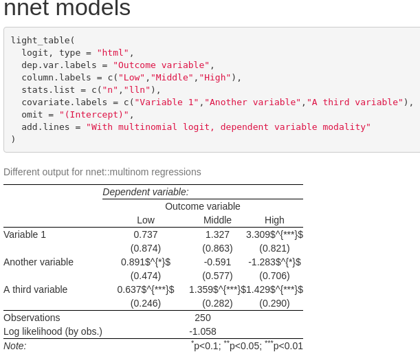

<!-- README.md is generated from README.Rmd. Please edit that file -->

```{r, include = FALSE}
knitr::opts_chunk$set(
  collapse = TRUE,
  warning = FALSE,
  message = FALSE,
  comment = "#>",
  fig.path = "man/figures/README-",
  out.width = "100%"
)
```

# tablelight

<!-- badges: start -->
[](https://travis-ci.org/linogaliana/tablelight)
[](https://codecov.io/gh/linogaliana/tablelight?branch=master)
[](https://gitlab.com/linogaliana/texlight/-/commits/master)
<!-- badges: end -->

The goal of `tablelight` is to propose functions to generate regression tables using as little as possible computer resources, especially RAM. This package has been designed because `stargazer` requires a huge amount of RAM to produce tables with voluminous data.

The basic idea is to `strip` regression objects from unnecessary fat and use the lightened object to produce a regression table. The package contains two sets of functions:

* `strip` function: a set of methods to remove heavier elements from a regression objects ;
* `light_table` function: a function to produce `LaTeX` tables (`HTML` tables in a future version).

The package is organized around a set of methods to extract information from regression objects. The list of regression objects accepted is, for the moment: `lm`, `glm`, `negbin`, `oglmx`, `zeroinfl`. Other types of regression objects will be added in the future. 

To install this package, you can do

```{r, eval = FALSE}
devtools::install_github("linogaliana/tablelight")
```

If you want to use the :package: 

```{r}
library(tablelight)
```

Here some examples of regression tables that can be produced with `tablelight`:



## Why do you need to strip fat from models ?

It is well known that regression objects are heavy in `R` (see this [blog post](http://www.win-vector.com/blog/2014/05/trimming-the-fat-from-glm-models-in-r/) that inspired this package).  For instance, the following regression object is about 10 times heavier than the initial data:

```{r}
df <- data.frame(
  x = rnorm(1e6),
  y = rnorm(1e6)
)
pryr::object_size(df)

regression <- lm(y ~ x, df)
pryr::object_size(regression)
```

Producing a regression table with `stargazer` requires to call `summary` that asks more RAM:

```{r}
library(profvis)
get_required_RAM <- function(profvis_object){
  return(
    max(profvis_object$x$message$prof$memalloc) - min(profvis_object$x$message$prof$memalloc)
  )
}
get_required_RAM(profvis(summary(regression)))
```

To produce a regression table, that's a deadly combo: you need to store a heavy regression object in memory and need more memory to summarize it in order to produce the table. With voluminous data, it is easy to make your RAM hit the limit available. The idea behind `tablelight` is that you just need heavy elements once (to produce standard error values and some fit statistics). Once they have been used, heavy elements can be thrown away. 

Most of the pieces to lighten regression objects are described [there](http://www.win-vector.com/blog/2014/05/trimming-the-fat-from-glm-models-in-r/). However, if you want to use `stargazer` later on, this will be impossible. You lose elements required to be able to run `summary` and hence produce the result table. A solution has been proposed by the `strip` package ([here](https://github.com/paulponcet/strip)): stripping the object selectively. Unfortunately, this method is only available for `lm` objects and the weight loss is around 30\%

```{r}
# install.packages('strip')
pryr::object_size(strip::strip(regression, keep = "summary"))
```

The `strip` method used in `tablelight` :package: is more drastic:

```{r}
pryr::object_size(tablelight::strip(regression))
```

Only the elements needed to print a result table are kept. Since using `stargazer` is no longer possible on a lightened model, `tablelight` :package: proposes a function (`tablelight::light_table`) to produce nice tables.

## Some examples

### General case

Let's say you want to produce a regression table from two objects. For the moment, the freedom in customizing the table is limited but future enhancements will add more and more flexibility.

```{r}
df <- data.frame(
  x = rnorm(1e6),
  y = rnorm(1e6)
)
df2 <- data.frame(
  x = rnorm(1e6),
  y = rnorm(1e6)
)

regression1 <- lm(y ~ x, df)
regression2 <- lm(y ~ x, df2)

get_required_RAM(profvis(
  capture.output(stargazer::stargazer(regression1, regression2)))
)
```

```{r, include=FALSE}
r1 <- get_required_RAM(profvis(
  capture.output(stargazer::stargazer(regression1, regression2)))
)
```


With `tablelight`, you will :

1. Strip an object using `strip` function ; 
2. Use `light_table` to produce the output. Models should be provided as a list:

```{r}
regression1 <- tablelight::strip(lm(y ~ x, df))
regression2 <- tablelight::strip(lm(y ~ x, df2))

get_required_RAM(profvis(
  capture.output(light_table(list(regression1, regression2))))
)
```

```{r, include=FALSE}
r2 <- get_required_RAM(profvis(
  capture.output(light_table(list(regression1, regression2))))
)
```

This is, approximatively, `r round(r1/r2)` times less memory needed.

The package produces table very similar in appearance with `stargazer`, for instance:




## Specificity with zero inflated models

It is hard to put together selection and outcome equations in a zero-inflated model with `stargazer`. Normally, you need to chose between reporting selection or outcome related terms. Sometimes you want to report both together. Unless using a hack with `stargazer` (see [here](https://stackoverflow.com/questions/40974843/how-to-report-both-selection-and-outcome-equation-of-selection-models-with-starg)), this is not possible with `stargazer`. 

This functionality has been integrated into `light_table` function. For instance, imagine you want to report both selection and outcome equations for a zero-inflated Poisson:

```{r, eval = FALSE}
data("bioChemists", package = "pscl")
fm_zip <- strip(pscl::zeroinfl(art ~ . | ., data = bioChemists))
fm_zinb <- strip(pscl::zeroinfl(art ~ . | ., data = bioChemists, dist = "negbin"))
```

In that case, you will use

```{r, eval = FALSE}
light_table(list(fm_zip, fm_zip),
            type = "html", 
            modeltype = c("selection","outcome"),
            dep.var.labels = c("Selection","Outcome"),
            stats.var.separate = 2L)
```


`stats.var.separate` is not compulsory but it's nicer to get multicolumned performance statistics rather than two times the same. 

If you want to compare zero-inflated Poisson and zero-inflated negative binomial models, you can use the following template:



# Regression tables for multinomial logit

Another implemented feature is the possibility to put together modulaties of a *Y* variable in a multinomial logit


